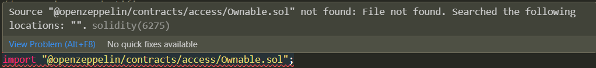

# paymaster

## Introduction
The idea behind this project is to learn to build account abstraction with the ERC4337 token, using foundry as a development framework

## Installation
### Foundry
The installation of Foundry is well explained in the foundry book, check out the instructions here https://book.getfoundry.sh/getting-started/installation
```bash
curl -L https://foundry.paradigm.xyz | bash
```

## Setting up the project
once, the foundry is installed we can create a new project using
```bash
forge init foundry-demo // forge-demo is name of the projec
```
once the project is created, use commands to check if everything is working correctly
```bash
cd foundry-demo && forge build
```

## Installing dependencies
Forge manages dependencies using git submodules by default, which means that it works with any GitHub repository that contains smart contracts.

To use OpenZeppelin we need to install it as a dependency in our project, to-do so use the command
```bash
forge install OpenZeppelin/openzeppelin-contracts
```
```
// forge install is command which is used for installing  dependencies 
// <https://github.com/OpenZeppelin/openzeppelin-contracts>
// use {{username}}/{{repo_name}} from the github url
```

## Integrate Foundry with VSCode
After installing OpenZeppelin as a dependency try importing something from it in the contract (your contract is there under the /src directory), If you are using VSCode an error will popup



To fix this error, add the following line to the .toml file
```bash toml
remappings = ["@openzeppelin/=lib/openzeppelin-contracts/"]
```

## Working with Foundry
### Compiling
To compile the contracts, run the following command
```bash
forge compile
```

### Testing
To test the contracts, run the following command:
```bash
forge test
```

